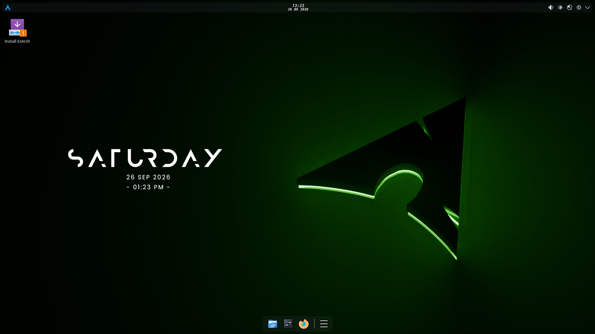

# SCROLL DOWN FOR RUSSIAN VERSION

# EzArch Linux
EzArch is an Arch based Linux distribution that targets lightweight and user-friendliness. Distro uses KDE Plasma as desktop environment and has pretty good custom theme with custom wallpaper.

# Live user!
EzArch has a live user with install option inside! That means you can try distro before installing it and after use Calamares graphical installer



# Requirements

I've tested EzArch on really old laptop with 1 core CPU and 2 GB of RAM, it was really laggy but it worked fine, i think minimal requirements are:

1 GB of RAM

20-30 GB HDD/SSD


P.S: Maybe later i'll make XFCE option in installer


# Installer

Graphical installer includes some packages that you might want to be installed in your system:

1.Office package that includes Libre Office(Microsoft office but better and for linux)

2.NVIDIA drivers

3.Gaming packages(Steam, Lutris(mostly for pirated or non-steam games), ProtonPlus(good manager of gaming compability tools), Wine and Bottles(both are kind of windows emulation for games, no it doesn't really lead to performance loss)

4.Some basic drivers that are selected for installation by default

5.Messengers(Discord and Telegram)

6.Emulation(Virtualbox for virtual machines and Waydroid for android emulation)

7.Development includes some code redactors and  IDEs(Code(debloated VS code), Zed(text redactor), Intellij IDEA(Java development), NeoVim(console text redactor)

8.Art & Design(Blender, Krita, GIMP and Inkscape)

9.Larp(basically just some cool terminal things, they serve no practical purpose, but looks cool)

# Getting EzArch

You can grab pre-built ISO file in Releases or if you have Arch or Arch-based system you can build ISO yourself:

First of all you need archiso:

```bash
sudo pacman -S archiso
```
After getting archiso you got to copy sources, go to copied directory and run special build script:

```bash
git clone https://github.com/PigeonGreg/EzArch.git
cd EzArch/
./build.sh
```
After that build process(5-10 minutes) will start and you will get ISO file in ~/EzArch/out

Then simply burn ISO on usb drive(using Rufus for example) or use Ventoy and you are good to go!

# EzArch Линукс

EzArch это Arch-базированный дистрибутив Linux который держит в приоритете легковестность и интуитивно понятность. Дистрибутив использвует KDE Plasma в качестве Графической оболочки и идет в комплекте с кастомной темой и обоями.

# Живой Пользователь

EzArch имеет живого пользователя по умолчанию! Это значит что вы можете попробовать дистрибутив перед установкой и в конце концов установить его используя графический установщик сделанный с помощью Calamares


# Системные требования

Я тестировал EzArch на очень старом ноутбуке с одноядерным процессором и 2 ГБ ОЗУ и оно лагало, но работало.

Я думаю минимальные требования это:

1 ГБ ОЗУ

20-30 ГБ на жествком диске

P.S:Может быть потом я добавлю опцию установки XFCE(очень легкая графическая оболочка) в установщике

# Установщик

Графический установщик включает в себя опцию установки пакетом(программ) которые вам могут понадобиться сразу после установки системы:

1.Оффисные программы(Один пакет LibreOffice(аналог Microsoft Office для линукс который будет даже лучше оригинальной программы)

2.Драйвера NVIDIA

3.Пакеты для гейминга(Steam, Lutris(Лаунчер для в основном пирток и игр не из стима в общем), ProtonPlus(Хорошая программа для управления инструментами совместимости которые нужны для запуска большинства игр), Wine и Bottles(оба по факту эмуляция Windows, но только отдельно для программы, тоже используется для запуска игр и другого ПО которого нету нативно на Linux)

4.Немного драйверов которые по умолчанию выбраны для установки

5.Мессенджеры(Discord и Telegram)

6.Эмуляция(Virtualbox для эмулирования виртуального ПК и Waydroid для эмуляции Android)

7.Разработка(Code(VS code без лишней чепухи), Zed(Неплохой текстовый редактор), Intellij IDEA(Java разработка), NeoVim(Консольный текстовый редактор)

8.Искусство и Дизайн(Blender, Krita, GIMP, Inkscape)

9.Ларпинг(Просто несколько терминальных штук, на деле пользы от них нет, но выглядит классно)

# Установка EzArch

Вы можете взять готовый ISO файл из вкладки Releases или если вы уже используете Arch Linux(ии дистрибутив на базе его) вы можете собрать ISO фай самостоятельно из исходного кода:

Для сборки начала вам надо установить archiso:
```bash
sudo pacman -S archiso
```

После этого вы должны скопировать исходный код, зайти в скопрованную директорию и запустить специальный скрипт для сборки:
```bash
git clone https://github.com/PigeonGreg/EzArch.git
cd EzArch/
./build.sh
```

После процесса сборки(5-10 минут) вы получить ISO файл в папке ~/EzArch/out

Потом просто запишить ISO на флешку(например используя Rufus) или используйте Ventoy.
